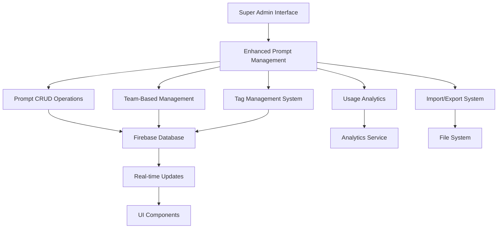

# Design Document

## Overview

The Enhanced Prompt Management feature will extend the existing super admin interface to provide comprehensive prompt management capabilities. The design builds upon the current Firebase-based architecture and React/Next.js frontend, adding new components and enhancing existing ones to support advanced prompt operations, team-based management, and improved user experience.

## Architecture

### Current System Analysis

The existing system uses:
- **Frontend**: Next.js with React components, TypeScript
- **Backend**: Firebase Realtime Database
- **Authentication**: Firebase Auth with custom user roles
- **State Management**: React hooks and context
- **UI Components**: Custom UI library with shadcn/ui

### Enhanced Architecture Components



## Components and Interfaces

### 1. Enhanced Super Admin Page Structure

The existing `src/app/super-admin/page.tsx` will be extended with new sections:

```typescript
interface SuperAdminPageState {
  // Existing state
  teams: Team[];
  users: User[];
  communityPrompts: Prompt[];
  
  // New state for enhanced prompt management
  selectedTeamForManagement: string | null;
  promptFilters: PromptFilters;
  promptSearchQuery: string;
  selectedPrompts: string[];
  promptUsageAnalytics: PromptAnalytics[];
  isImportDialogOpen: boolean;
  isExportDialogOpen: boolean;
}

interface PromptFilters {
  tags: string[];
  sharing: ('private' | 'team' | 'global')[];
  dateRange: { start: Date; end: Date } | null;
  createdBy: string | null;
}
```

### 2. New Component Architecture

#### PromptManagementPanel Component
```typescript
interface PromptManagementPanelProps {
  prompts: Prompt[];
  teams: Team[];
  selectedTeam: string | null;
  onTeamSelect: (teamId: string | null) => void;
  onPromptUpdate: (prompt: Prompt) => void;
  onPromptDelete: (promptId: string) => void;
  onBulkOperation: (operation: BulkOperation, promptIds: string[]) => void;
}
```

#### TeamPromptSelector Component
```typescript
interface TeamPromptSelectorProps {
  teams: Team[];
  selectedTeam: string | null;
  onTeamSelect: (teamId: string | null) => void;
  promptCounts: Record<string, number>;
}
```

#### PromptTable Component
```typescript
interface PromptTableProps {
  prompts: Prompt[];
  selectedPrompts: string[];
  onPromptSelect: (promptId: string, selected: boolean) => void;
  onPromptEdit: (prompt: Prompt) => void;
  onPromptDelete: (promptId: string) => void;
  sortConfig: SortConfig;
  onSort: (field: keyof Prompt) => void;
}
```

#### TagManager Component
```typescript
interface TagManagerProps {
  prompt: Prompt;
  availableTags: string[];
  onTagsUpdate: (promptId: string, tags: string[]) => void;
}
```

#### PromptAnalytics Component
```typescript
interface PromptAnalyticsProps {
  promptId: string;
  analytics: PromptUsageAnalytics;
  teamAssignments: TeamAssignment[];
}

interface PromptUsageAnalytics {
  totalUsage: number;
  lastUsed: string | null;
  usageByTeam: Record<string, number>;
  usageByUser: Record<string, number>;
  usageTrend: UsageDataPoint[];
}
```

### 3. Enhanced Database Schema

Extending the existing Firebase structure:

```typescript
// Enhanced Prompt interface
interface EnhancedPrompt extends Prompt {
  // Existing fields: id, title, content, tags, sharing, createdBy, teamId, createdAt
  
  // New fields
  lastModified: string;
  modifiedBy: string;
  usageCount: number;
  lastUsed: string | null;
  assignedTeams: string[]; // For multi-team assignment
  metadata: {
    version: number;
    changelog: ChangelogEntry[];
  };
}

interface ChangelogEntry {
  timestamp: string;
  userId: string;
  action: 'created' | 'updated' | 'deleted' | 'tagged';
  changes: Record<string, { old: any; new: any }>;
}

// New analytics collection
interface PromptUsageLog {
  id: string;
  promptId: string;
  userId: string;
  teamId: string | null;
  timestamp: string;
  action: 'viewed' | 'copied' | 'used';
}
```

## Data Models

### 1. Enhanced Prompt Management State

```typescript
interface PromptManagementState {
  view: 'global' | 'team-specific';
  selectedTeam: string | null;
  filters: {
    search: string;
    tags: string[];
    sharing: ('private' | 'team' | 'global')[];
    dateRange: DateRange | null;
    createdBy: string | null;
    hasUsage: boolean | null;
  };
  sorting: {
    field: keyof Prompt;
    direction: 'asc' | 'desc';
  };
  selection: {
    selectedPrompts: Set<string>;
    selectAll: boolean;
  };
  pagination: {
    page: number;
    pageSize: number;
    total: number;
  };
}
```

### 2. Team Assignment Model

```typescript
interface TeamPromptAssignment {
  teamId: string;
  promptId: string;
  assignedBy: string;
  assignedAt: string;
  permissions: {
    canEdit: boolean;
    canDelete: boolean;
    canReassign: boolean;
  };
}
```

### 3. Import/Export Models

```typescript
interface PromptExportData {
  version: string;
  exportedAt: string;
  exportedBy: string;
  prompts: EnhancedPrompt[];
  teamAssignments: TeamPromptAssignment[];
  metadata: {
    totalPrompts: number;
    teamsIncluded: string[];
    exportScope: 'global' | 'team' | 'selected';
  };
}

interface ImportResult {
  success: boolean;
  imported: number;
  skipped: number;
  errors: ImportError[];
  conflicts: ConflictResolution[];
}
```

## Error Handling

### 1. Permission-Based Error Handling

```typescript
class PromptManagementError extends Error {
  constructor(
    message: string,
    public code: 'UNAUTHORIZED' | 'NOT_FOUND' | 'VALIDATION_ERROR' | 'CONFLICT',
    public details?: any
  ) {
    super(message);
  }
}

// Error handling middleware
const handlePromptOperation = async (operation: () => Promise<any>) => {
  try {
    return await operation();
  } catch (error) {
    if (error instanceof PromptManagementError) {
      switch (error.code) {
        case 'UNAUTHORIZED':
          toast.error('You do not have permission to perform this action');
          break;
        case 'NOT_FOUND':
          toast.error('Prompt not found or has been deleted');
          break;
        case 'VALIDATION_ERROR':
          toast.error(`Validation error: ${error.message}`);
          break;
        case 'CONFLICT':
          toast.error('This action conflicts with existing data');
          break;
      }
    } else {
      toast.error('An unexpected error occurred');
    }
    throw error;
  }
};
```

### 2. Optimistic Updates with Rollback

```typescript
interface OptimisticUpdate<T> {
  id: string;
  operation: 'create' | 'update' | 'delete';
  originalData: T | null;
  newData: T | null;
  timestamp: number;
}

class OptimisticUpdateManager {
  private updates = new Map<string, OptimisticUpdate<any>>();
  
  async performUpdate<T>(
    id: string,
    operation: 'create' | 'update' | 'delete',
    optimisticData: T,
    serverOperation: () => Promise<T>
  ): Promise<T> {
    // Apply optimistic update
    this.applyOptimisticUpdate(id, operation, optimisticData);
    
    try {
      const result = await serverOperation();
      this.confirmUpdate(id);
      return result;
    } catch (error) {
      this.rollbackUpdate(id);
      throw error;
    }
  }
}
```

## Testing Strategy

### 1. Unit Testing

- **Component Testing**: Test individual components with React Testing Library
- **Hook Testing**: Test custom hooks for prompt management logic
- **Utility Testing**: Test helper functions for data transformation and validation

```typescript
// Example test structure
describe('PromptManagementPanel', () => {
  it('should display prompts in table format', () => {});
  it('should handle team selection', () => {});
  it('should support bulk operations', () => {});
  it('should handle search and filtering', () => {});
});

describe('usePromptManagement hook', () => {
  it('should manage prompt state correctly', () => {});
  it('should handle optimistic updates', () => {});
  it('should sync with Firebase', () => {});
});
```

### 2. Integration Testing

- **Firebase Integration**: Test database operations with Firebase emulator
- **Permission Testing**: Verify access control works correctly
- **Real-time Updates**: Test live data synchronization

### 3. End-to-End Testing

- **User Workflows**: Test complete user journeys through Playwright
- **Cross-browser Testing**: Ensure compatibility across browsers
- **Performance Testing**: Verify performance with large datasets

```typescript
// Example E2E test
test('Super user can manage prompts across teams', async ({ page }) => {
  await page.goto('/super-admin');
  await page.selectOption('[data-testid=team-selector]', 'team-1');
  await page.click('[data-testid=prompt-edit-button]');
  await page.fill('[data-testid=prompt-title]', 'Updated Title');
  await page.click('[data-testid=save-button]');
  await expect(page.locator('[data-testid=prompt-title]')).toContainText('Updated Title');
});
```

### 4. Performance Testing

- **Large Dataset Handling**: Test with 1000+ prompts
- **Real-time Update Performance**: Measure update propagation time
- **Memory Usage**: Monitor for memory leaks during extended use

## Security Considerations

### 1. Access Control

- **Role-based Permissions**: Enforce super user requirements for all operations
- **Team Isolation**: Ensure team-specific data remains isolated
- **Audit Logging**: Track all prompt management operations

### 2. Data Validation

- **Input Sanitization**: Sanitize all user inputs to prevent XSS
- **Schema Validation**: Validate data structures before database operations
- **File Upload Security**: Secure handling of import files

### 3. Firebase Security Rules

```javascript
// Enhanced security rules for prompt management
{
  "rules": {
    "prompts": {
      ".read": "auth != null",
      "$promptId": {
        ".write": "root.child('users').child(auth.uid).child('role').val() == 'super_user'",
        ".validate": "newData.hasChildren(['title', 'content', 'sharing', 'createdBy'])"
      }
    },
    "prompt-analytics": {
      ".read": "root.child('users').child(auth.uid).child('role').val() == 'super_user'",
      ".write": "root.child('users').child(auth.uid).child('role').val() == 'super_user'"
    }
  }
}
```

## Performance Optimization

### 1. Data Loading Strategies

- **Pagination**: Implement virtual scrolling for large prompt lists
- **Lazy Loading**: Load prompt details on demand
- **Caching**: Cache frequently accessed data with React Query

### 2. Real-time Updates

- **Selective Subscriptions**: Subscribe only to relevant data changes
- **Debounced Updates**: Batch rapid updates to prevent UI thrashing
- **Connection Management**: Handle offline/online states gracefully

### 3. Bundle Optimization

- **Code Splitting**: Split prompt management code into separate chunks
- **Tree Shaking**: Remove unused code from bundles
- **Asset Optimization**: Optimize images and icons used in the interface

## Accessibility

### 1. Keyboard Navigation

- **Tab Order**: Logical tab sequence through all interactive elements
- **Keyboard Shortcuts**: Common shortcuts for frequent operations
- **Focus Management**: Clear focus indicators and management

### 2. Screen Reader Support

- **ARIA Labels**: Comprehensive labeling for all interactive elements
- **Live Regions**: Announce dynamic content changes
- **Semantic HTML**: Use proper HTML elements for better accessibility

### 3. Visual Accessibility

- **Color Contrast**: Ensure sufficient contrast ratios
- **Text Scaling**: Support browser text scaling up to 200%
- **Motion Preferences**: Respect user motion preferences