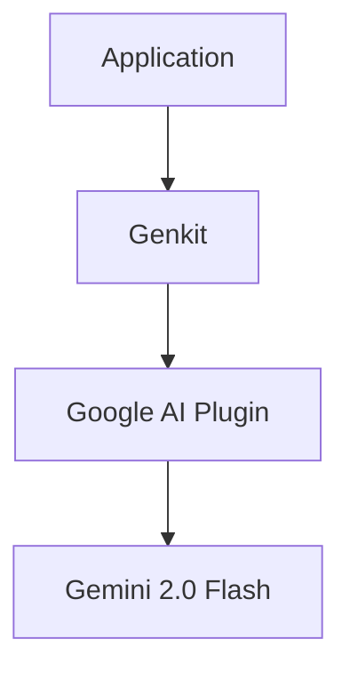
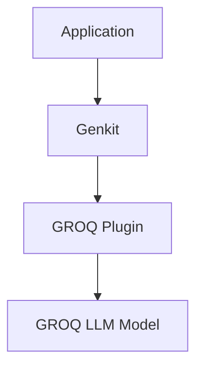

# Design Document: Gemini to GROQ Migration

## Overview

This design document outlines the approach for migrating the LLM model from Google's Gemini to GROQ in the application. The migration is intended for a testing phase to evaluate GROQ's performance and capabilities. The design focuses on maintaining the existing functionality while changing the underlying model provider.

## Architecture

The current architecture uses Genkit as an abstraction layer for AI interactions, with Google AI (Gemini) as the provider. The new architecture will continue to use Genkit but will replace the Google AI plugin with a GROQ plugin. This approach minimizes changes to the application code while allowing for the model provider switch.

### Current Architecture



### New Architecture



## Components and Interfaces

### 1. Genkit Configuration

The primary change will be in the `src/ai/genkit.ts` file, where we'll replace the Google AI plugin with the GROQ plugin. The interface for the rest of the application will remain the same, as Genkit abstracts away the specific provider implementation.

Current implementation:
```typescript
import {genkit} from 'genkit';
import {googleAI} from '@genkit-ai/googleai';

export const ai = genkit({
  plugins: [googleAI()],
  model: 'googleai/gemini-2.0-flash',
});
```

Proposed implementation:
```typescript
import {genkit} from 'genkit';
import {groq} from '@genkit-ai/groq';

export const ai = genkit({
  plugins: [groq()],
  model: 'groq/llama3-70b-8192', // Example model, will be configurable
});
```

### 2. Environment Configuration

We'll need to update the environment configuration to support GROQ API keys. This will involve:

1. Adding GROQ-specific environment variables to `.env` and `.env.local` files
2. Updating documentation to reflect the new configuration requirements

Example environment variables:
```
GROQ_API_KEY=your_groq_api_key
GROQ_MODEL=groq/llama3-70b-8192
```

### 3. Model Selection Mechanism

To support easy switching between models, we'll implement a configuration-based model selection mechanism:

```typescript
import {genkit} from 'genkit';
import {googleAI} from '@genkit-ai/googleai';
import {groq} from '@genkit-ai/groq';

const MODEL_PROVIDER = process.env.MODEL_PROVIDER || 'groq'; // Default to GROQ for testing

const getPlugin = () => {
  switch (MODEL_PROVIDER.toLowerCase()) {
    case 'gemini':
      return {
        plugin: googleAI(),
        model: process.env.GEMINI_MODEL || 'googleai/gemini-2.0-flash'
      };
    case 'groq':
    default:
      return {
        plugin: groq(),
        model: process.env.GROQ_MODEL || 'groq/llama3-70b-8192'
      };
  }
};

const {plugin, model} = getPlugin();

export const ai = genkit({
  plugins: [plugin],
  model: model,
});
```

## Data Models

No changes to the application's data models are required for this migration. The Genkit abstraction layer ensures that the data structures used by the application remain consistent regardless of the underlying model provider.

## Error Handling

We'll enhance error handling to provide clear feedback when GROQ-specific issues occur:

1. API key validation and error reporting
2. Model availability checks
3. Rate limiting and quota management
4. Response format validation

Example error handling:
```typescript
try {
  const result = await ai.generate({
    // generation parameters
  });
  return result;
} catch (error) {
  if (error.message.includes('API key')) {
    console.error('GROQ API key error:', error.message);
    // Handle API key issues
  } else if (error.message.includes('model')) {
    console.error('GROQ model error:', error.message);
    // Handle model issues
  } else {
    console.error('GROQ error:', error);
    // Handle other errors
  }
  throw error;
}
```

## Testing Strategy

The testing strategy will focus on ensuring that the GROQ integration works correctly and maintains feature parity with the Gemini implementation:

1. **Unit Tests**: Update existing unit tests to work with the GROQ implementation
2. **Integration Tests**: Test the GROQ integration with the application's AI features
3. **Performance Tests**: Compare response times and quality between Gemini and GROQ
4. **Error Handling Tests**: Verify that error conditions are handled correctly

### Test Cases

1. Verify that prompt optimization works correctly with GROQ
2. Verify that prompt metadata generation produces equivalent results
3. Test error handling for invalid API keys, unavailable models, etc.
4. Compare response quality between Gemini and GROQ for the same prompts
5. Measure and compare response times between Gemini and GROQ

## Implementation Considerations

### Dependencies

We'll need to add the GROQ Genkit plugin to the project dependencies:

```json
{
  "dependencies": {
    "@genkit-ai/groq": "^1.0.0"
  }
}
```

### Configuration

The implementation will support configuration through environment variables, allowing for easy switching between models and providers.

### Performance Monitoring

We'll implement basic performance monitoring to compare GROQ and Gemini:

```typescript
const startTime = Date.now();
const result = await ai.generate({
  // generation parameters
});
const endTime = Date.now();
console.log(`AI request completed in ${endTime - startTime}ms`);
```

### Documentation

We'll update the project documentation to reflect the GROQ integration:

1. Update README.md with GROQ configuration instructions
2. Add GROQ-specific notes to relevant documentation files
3. Document the process for switching between Gemini and GROQ